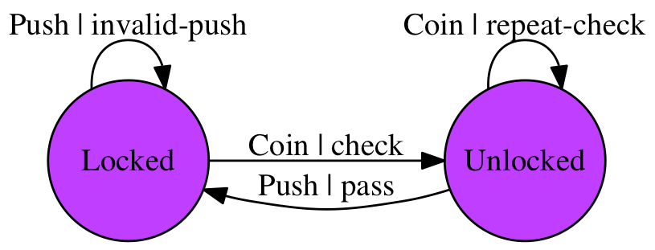

[](https://opensource.org/licenses/Apache-2.0) [](http://godoc.org/github.com/smallnest/gofsm)   [](http://gocover.io/github.com/smallnest/gofsm) [](https://goreportcard.com/report/github.com/smallnest/gofsm)


[gofsm](https://github.com/smallnest/gofsm)是一个简单、小巧而又特色的有限状态机（FSM）。

github已经有了很多个状态机的实现，比如文末列举的一些，还为什么要再发明轮子呢？

原因在于这些状态机有一个特点，就是一个状态机维护一个对象的状态，这样一个状态机就和一个具体的图像实例关联在一起，在有些情况下，这没有什么问题，而且是很好的设计，而且比较符合状态机的定义。但是在有些情况下，当我们需要维护成千上百个对象的时候，需要创建成千上百个状态机对象，这其实是很大的浪费，因为在大部分情况下，对象本身自己会维护/保持自己当前的状态，我们只需把对象当前的状态传递给一个共用的状态机就可以了，也就是gofsm本身是“stateless”，本身它包维护一个或者多个对象的状态，所有需要的输入由调用者输入，它只负责状态的转换的逻辑，所以它的实现非常的简洁实用，这是创建gofsm的一个目的。

第二个原因它提供了Moore和Mealy两种状态机的统一接口，并且提供了UML状态机风格的Action处理，以程序员更熟悉的方式处理状态的改变。

第三个原因，当我们谈论起状态机的时候，我们总会画一个状态转换图，大家可以根据这这张图进行讨论、设计、实现和验证状态的迁移。但是对于代码来说，实现真的和你的设计是一致的吗，你怎么保证？gofsm提供了一个简单的方法，那就是它可以输出图片或者pdf文件，你可以利用输出的状态机图和你的设计进行比较，看看实现和设计是否一致。



## 有限状态机
有限状态机（finite-state machine）常常用于计算机程序和时序逻辑电路的设计数学模型。它被看作是一种抽象的机器，可以有有限个状态。任意时刻这个机器只有唯一的一个状态，这个状态称为当前状态。当有外部的事件或者条件被触发，它可以从一个状态转换到另一个状态，这就是转换（transition）。一个FSM就是由所有的状态、初始状态和每个转换的触发条件所定义。有时候，当这个转换发生的时候，我们可以要执行一些事情，我们称之为动作（Action）。

现实情况中，我们实际上遇到了很多的这种状态机的情况，只不过我们并没有把它们抽象出来，比如路口的红绿灯，总是在红、黄、绿的状态之间转变，比如电梯的状态，包括开、关、上、下等几个状态。

有限状态机可以有效清晰的为一大堆的问题建立模型，大量应用于电子设计、通讯协议、语言解析和其它的工程应用中，比如TCP/IP协议栈。


以一个转门为例，这种专门在一些会展、博物馆、公园的门口很常见，顾客可以投币或者刷卡刷票进入，我们下面以投币(Coin)统称这个触发事件。如果你不投币，闸门是锁着的，你推不动它的转臂，而且投一次币只能进去一个人，过去之后闸门又是锁着的，挺智能的 ：）。


如果我们抽象出来它的状态图，可以用下图表示：


它有两个状态：`Locked`、`Unlocked`。有两个输入（input）会影响它的状态，投币(coin)和推动转臂（push）。
1. 在Locked状态， push没有作用。不管比push多少次闸门的状态还是lock
2. 在Locked状态，投币会让闸门开锁，闸门可以让一个人通过
3. 在Unlocked状态，投币不起作用，闸门还是开着
4. 在Unlocked状态，如果有人push通过，人通过后闸门会由Unlocked状态转变成Locked状态。

这是一个简单的闸门的状态转换，却是一个很好的理解状态的典型例子。

以表格来表示：
<table><tbody><tr><th>Current State</th><th>Input</th><th>Next State</th><th>Output</th></tr><tr><th rowspan="2">Locked</th><td>coin</td><td>Unlocked</td><td>Unlock turnstile so customer can push through</td></tr><tr><td>push</td><td>Locked</td><td>None</td></tr><tr><th rowspan="2">Unlocked</th><td>coin</td><td>Unlocked</td><td>None</td></tr><tr><td>push</td><td>Locked</td><td>When customer has pushed through, lock turnstile</td></tr></tbody></table>


UML也有状态图的改变，它扩展了FSM的概念，提供了层次化的嵌套状态（Hierarchically nested states）和正交区域（orthogonal regions），当然这和本文没有太多的关系，有兴趣的读者可以找UML的资料看看。但是它提供了一个很好的概念，也就是动作（Action）。就像Mealy状态机所需要的一样，动作依赖系统的状态和触发事件，而它的Entry Action和Exit Action，却又像Moore 状态机一样，不依赖输入，只依赖状态。所以UML的动作有三种，一种是事件被处理的时候，状态机会执行特定的动作，比如改变变量、执行I/O、调用方法、触发另一个事件等。而离开一个状态，可以执行Exit action，进入一个状态，则执行Entry action。记住，收到一个事件，对象的状态不会改变，比如上边闸门的例子，在Locked状态下push多少次状态都没改变，这这种情况下，不会执行Exit和Entry action。

gofsm提供了这种扩展的模型，当然如果你不想使用这种扩展，你也可以不去实现Entry和Exit。


可以提到了两种状态机，这两种状态机是这样来区分的：

* **Moore machine**
Moore状态机只使用entry action，输出只依赖状态，不依赖输入。
* **Mealy machine**
Mealy状态机只使用input action，输出依赖输入input和状态state。使用这种状态机通常可以减少状态的数量。

gofsm提供了一个通用的接口，你可以根据需要确定使用哪个状态机。从软件开发的实践上来看，有时候你并不一定要关注状态机的区分，而是清晰的抽象、设计你所关注的对象的状态、触发条件以及要执行的动作。


## gofsm
gofsm参考了 [elimisteve/fsm](https://github.com/elimisteve/fsm) 的实现，实现了一种单一状态机处理多个对象的方法，并且提供了输出状态图的功能。

它除了定义对象的状态外，还定义了触发事件以及处理的Action，这些都是通过字符串来表示的，在使用的时候很容易的和你的对象、方法对应起来。

使用gofsm也很简单，当然第一步将库拉到本地：
```sh
go get -u github.com/smallnest/gofsm
```

我们以上面的闸门为例，看看gofsm是如何使用的。

注意下面的单个状态机可以处理并行地的处理多个闸门的状态改变，虽然例子中只生成了一个闸门对象。

首先定义一个闸门对象,它包含一个State，表示它当前的状态：
```go
type Turnstile struct {
	ID         uint64
	EventCount uint64 //事件统计
	CoinCount  uint64 //投币事件统计
	PassCount  uint64 //顾客通过事件统计
	State      string //当前状态
	States     []string //历史经过的状态
}
```

状态机的初始化简单直接：
```go 
func initFSM() *StateMachine {
	delegate := &DefaultDelegate{p: &TurnstileEventProcessor{}}

	transitions := []Transition{
		Transition{From: "Locked", Event: "Coin", To: "Unlocked", Action: "check"},
		Transition{From: "Locked", Event: "Push", To: "Locked", Action: "invalid-push"},
		Transition{From: "Unlocked", Event: "Push", To: "Locked", Action: "pass"},
		Transition{From: "Unlocked", Event: "Coin", To: "Unlocked", Action: "repeat-check"},
	}

	return NewStateMachine(delegate, transitions...)
}
```

你定义好转换对应关系`transitions`,一个`Transition`代表一个转换，从某个状态到另外一个状态，触发的事件名，要执行的Action。
因为Action是字符串，所以你需要实现`delegate`将Action和对应的要处理的方法对应起来。

注意from和to的状态可以一样，在这种情况下，状态没有发生改变，只是需要处理Action就可以了。

如果Action为空，也就是不需要处理事件，只是发生状态的改变而已。

处理Action的类型如下：
```go 
type TurnstileEventProcessor struct{}

func (p *TurnstileEventProcessor) OnExit(fromState string, args []interface{}) {
	……
}

func (p *TurnstileEventProcessor) Action(action string, fromState string, toState string, args []interface{}) {
	……
}

func (p *TurnstileEventProcessor) OnEnter(toState string, args []interface{}) {
    ……
}
```

然后我们就可以触发一些事件看看闸门的状态机是否正常工作：
```go
	ts := &Turnstile{
		ID:     1,
		State:  "Locked",
		States: []string{"Locked"},
	}
	fsm := initFSM()

	//推门
	//没刷卡/投币不可进入
	err := fsm.Trigger(ts.State, "Push", ts)
	if err != nil {
		t.Errorf("trigger err: %v", err)
	}

	//推门
	//没刷卡/投币不可进入
	err = fsm.Trigger(ts.State, "Push", ts)
	if err != nil {
		t.Errorf("trigger err: %v", err)
	}

	//刷卡或者投币
	//不容易啊，终于解锁了
	err = fsm.Trigger(ts.State, "Coin", ts)
	if err != nil {
		t.Errorf("trigger err: %v", err)
	}

	//刷卡或者投币
	//这时才解锁
	err = fsm.Trigger(ts.State, "Coin", ts)
	if err != nil {
		t.Errorf("trigger err: %v", err)
	}

	//推门
	//这时才能进入，进入后闸门被锁
	err = fsm.Trigger(ts.State, "Push", ts)
	if err != nil {
		t.Errorf("trigger err: %v", err)
	}

	//推门
	//无法进入，闸门已锁
	err = fsm.Trigger(ts.State, "Push", ts)
	if err != nil {
		t.Errorf("trigger err: %v", err)
	}

	lastState := Turnstile{
		ID:         1,
		EventCount: 6,
		CoinCount:  2,
		PassCount:  1,
		State:      "Locked",
		States:     []string{"Locked", "Unlocked", "Locked"},
	}

	if !compareTurnstile(&lastState, ts) {
		t.Errorf("Expected last state: %+v, but got %+v", lastState, ts)
	} else {
		t.Logf("最终的状态: %+v", ts)
	}
```

如果想将状态图输出图片，可以调用下面的方法，它实际是调用graphviz生成的，所以请确保你的机器上是否安装了这个软件，你可以执行`dot -h`检查一下：
```go
	fsm.Export("state.png")
```
生成的图片就是文首的闸门的状态机的图片。

如果你想定制graphviz的参数，你可以调用另外一个方法：
```go 
func (m *StateMachine) ExportWithDetails(outfile string, format string, layout string, scale string, more string) error
```

## 其它Go语言实现的FSM
如果你发现gofsm的功能需要改进，或者有一些想法、或者发现了bug，请不用迟疑，在[issue](https://github.com/smallnest/gofsm/issues)中提交你的意见和建议，我会及时的进行反馈。

如果你觉得本项目有用，或者将来可能会使用，请star这个项目 [smallnest/gofsm](https://github.com/smallnest/gofsm)。

如果你想比较其它的Go语言实现的fsm，可以参考下面的列表：
* [elimisteve/fsm](https://github.com/elimisteve/fsm)
* [looplab/fsm](https://github.com/looplab/fsm)
* [vaughan0/go-fsm](https://github.com/vaughan0/go-fsm)
* [WatchBeam/fsm](https://github.com/WatchBeam/fsm)
* [DiscoViking/fsm](https://github.com/DiscoViking/fsm)
* [autocube/hsm](https://github.com/autocube/hsm)
* [theckman/go-fsm](https://github.com/theckman/go-fsm)
* [Zumata/fsm](https://github.com/Zumata/fsm)
* [syed/go-fsm](https://github.com/syed/go-fsm)
* [go-rut/fsm](https://github.com/go-rut/fsm)
* [yandd/fsm](https://github.com/yandd/fsm)
* [go-trellis/fsm](https://github.com/go-trellis/fsm)
* ……

## 参考资料
1. https://en.wikipedia.org/wiki/Finite-state_machine
